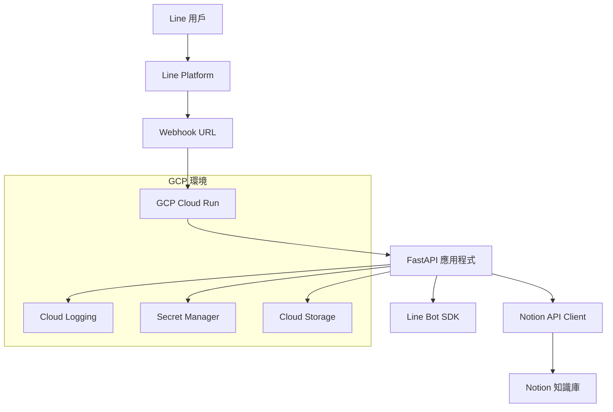
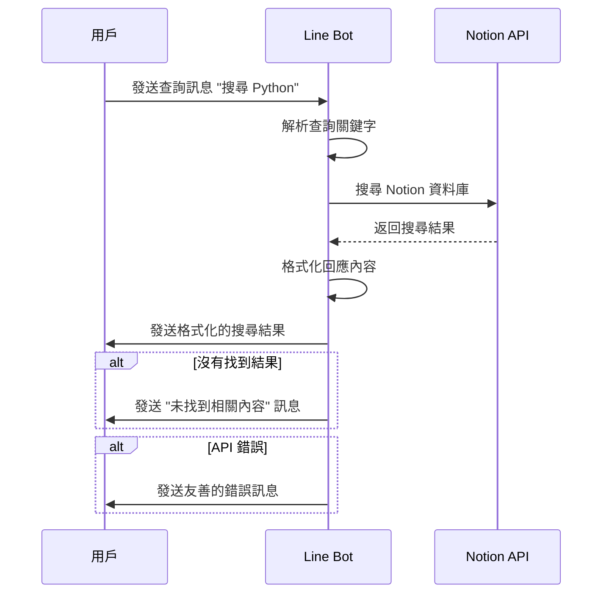

# Line Bot 串接 Notion API 架構設計文件

## 專案概述

建立一個 Line Bot 來查詢 Notion 知識庫/筆記資料庫，使用 Python + FastAPI 開發，並部署到 Google Cloud Platform。

## 系統架構圖



## 技術規格

### 核心技術棧
- **後端框架**: FastAPI (Python 3.9+)
- **Line Bot SDK**: line-bot-sdk
- **Notion API**: notion-client
- **部署平台**: Google Cloud Run
- **資料庫**: 不需要（直接查詢 Notion）
- **日誌**: Google Cloud Logging
- **密鑰管理**: Google Secret Manager

### 主要功能模組

1. **Webhook 處理器**
   - 接收 Line 平台的訊息
   - 驗證請求簽名
   - 路由不同類型的訊息

2. **Notion 查詢引擎**
   - 關鍵字搜尋
   - 標題匹配
   - 內容摘要提取

3. **回應格式化器**
   - 將 Notion 內容轉換為 Line 訊息格式
   - 支援文字、圖片、連結等多媒體內容
   - 處理長文本的分段顯示

4. **錯誤處理系統**
   - API 錯誤處理
   - 用戶友善的錯誤訊息
   - 系統監控和告警

## 用戶互動流程



## 專案結構

```
line-notion-bot/
├── app/
│   ├── __init__.py
│   ├── main.py              # FastAPI 應用程式入口
│   ├── config.py            # 配置管理
│   ├── models/
│   │   ├── __init__.py
│   │   └── line_models.py   # Line 訊息模型
│   ├── services/
│   │   ├── __init__.py
│   │   ├── line_service.py  # Line Bot 服務
│   │   └── notion_service.py # Notion API 服務
│   └── utils/
│       ├── __init__.py
│       ├── formatter.py     # 回應格式化
│       └── logger.py        # 日誌工具
├── tests/
│   ├── __init__.py
│   ├── test_line_service.py
│   └── test_notion_service.py
├── requirements.txt
├── Dockerfile
├── cloudbuild.yaml          # GCP 建置配置
├── app.yaml                 # App Engine 配置（備選）
└── README.md
```

## 環境變數需求

```
LINE_CHANNEL_ACCESS_TOKEN=你的Line頻道存取權杖
LINE_CHANNEL_SECRET=你的Line頻道密鑰
NOTION_API_TOKEN=你的Notion整合權杖
NOTION_DATABASE_ID=你的Notion資料庫ID
GCP_PROJECT_ID=你的GCP專案ID
```

## 核心功能設計

### 1. 訊息處理流程
- 接收 Line Webhook 事件
- 解析用戶訊息內容
- 提取查詢關鍵字
- 調用 Notion API 搜尋
- 格式化回應內容
- 發送回覆訊息

### 2. Notion 查詢策略
- **標題搜尋**: 優先匹配頁面標題
- **內容搜尋**: 全文搜尋頁面內容
- **標籤過濾**: 根據標籤分類搜尋
- **結果排序**: 按相關性排序結果

### 3. 回應格式設計
- **簡潔摘要**: 顯示頁面標題和簡短摘要
- **連結提供**: 提供 Notion 頁面直接連結
- **分頁顯示**: 多個結果時分頁顯示
- **無結果處理**: 友善的無結果提示

## 安全性考量

1. **API 金鑰管理**: 使用 GCP Secret Manager
2. **Webhook 驗證**: 驗證 Line 平台簽名
3. **錯誤資訊**: 避免洩露敏感資訊
4. **存取控制**: 限制 Notion 資料庫存取權限

## 效能優化

1. **快取機制**: 快取常用查詢結果
2. **非同步處理**: 使用 FastAPI 非同步功能
3. **連線池**: 優化 API 連線管理
4. **回應時間**: 控制在 3 秒內回應

## 監控與日誌

1. **應用程式日誌**: 記錄關鍵操作和錯誤
2. **效能監控**: 監控 API 回應時間
3. **錯誤追蹤**: 追蹤和分析錯誤模式
4. **使用統計**: 記錄查詢頻率和熱門關鍵字

## 部署策略

1. **容器化**: 使用 Docker 容器化應用程式
2. **CI/CD**: 使用 Cloud Build 自動化部署
3. **環境分離**: 區分開發、測試、生產環境
4. **版本控制**: 支援藍綠部署和回滾

這個架構設計考慮了可擴展性、安全性、可維護性和用戶體驗，為後續的實作提供了清晰的指導方針。